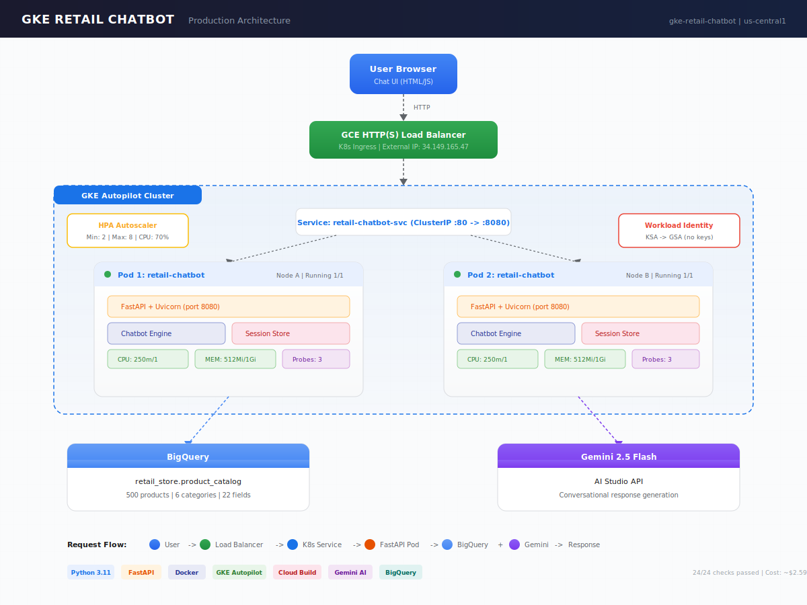

# GKE Retail Chatbot

Production-grade ecommerce shopping assistant deployed on Google Kubernetes Engine (Autopilot). Powered by Gemini 2.5 Flash + BigQuery. No agent frameworks. Clean Python.

**24/24 verification checks passed | Cost: ~$2.59 | 4 builds to production**

## Architecture


```
User Browser  ->  GCE Load Balancer  ->  K8s Service  ->  FastAPI Pods (x2)
                                                              |
                                              BigQuery (500 products) + Gemini 2.5 Flash
```

## What This Demonstrates

| Skill | Implementation |
|-------|---------------|
| Containerization | Multi-stage Dockerfile, non-root user |
| Kubernetes | Deployment, Service, Ingress, HPA, topology spread |
| CI/CD | Cloud Build pipeline (4 iterations) |
| Autoscaling | HPA: 2-8 pods, 70% CPU target, 5-min scale-down |
| Security | Workload Identity (zero key files), K8s Secrets |
| Health checks | Liveness, readiness, startup probes |
| Load balancing | GCE L7 HTTP LB via Ingress |
| AI | Gemini 2.5 Flash for conversational responses |
| Data | BigQuery: 500 products, 6 categories, 22 fields |
| Observability | Structured logging, request tracing |

## Issues Encountered and Resolved

| Issue | Root Cause | Fix |
|-------|-----------|-----|
| Cloud Shell auth expired | Token timeout during 8-min cluster creation | Re-authenticate + get-credentials |
| Jinja2 template error | CSS `{#chat}` parsed as Jinja comment | Serve HTML as static file, bypass Jinja |
| Gemini 404 | `gemini-2.0-flash` deprecated for new users | Switched to `gemini-2.5-flash` |
| Rate limiting | Free tier quota exceeded during debugging | New API key + secret rotation |

## Quick Start

See [docs/BUILD_GUIDE.md](docs/BUILD_GUIDE.md) for step-by-step commands.

## Project Structure
```
gke-retail-chatbot/
 Dockerfile                    # Multi-stage production build
 cloudbuild.yaml               # CI/CD pipeline
 data/generate_catalog.py      # 500-product data generator
 src/
    app.py                    # FastAPI server (5 endpoints)
    chatbot.py                # Gemini + BigQuery engine
    templates/chat.html       # Chat UI
 k8s/
    deployment.yaml           # Pods, probes, resources, topology
    service.yaml              # ClusterIP routing
    ingress.yaml              # External load balancer
    hpa.yaml                  # Autoscaling rules
    config.yaml               # ConfigMap + Secret
    service-account.yaml      # Workload Identity
 scripts/
    verify.sh                 # 24-check verification
    teardown.sh               # Cleanup with verification
    load-test.sh              # HPA demo
 docs/
     PROJECT_DOCUMENTATION.md   # Complete build documentation
     ARCHITECTURE.md            # Decision records
     BUILD_GUIDE.md             # Step-by-step commands
     QA_GUIDE.md                # Interview prep
     architecture-diagram.svg   # System diagram
```

## ADK Comparison

This project was built alongside an ADK Shopping Chatbot. See [PROJECT_DOCUMENTATION.md](docs/PROJECT_DOCUMENTATION.md) for a detailed comparison.

| | ADK Chatbot | GKE Chatbot |
|--|------------|-------------|
| Framework | Google ADK (multi-agent) | No framework (direct API) |
| Deployment | Local dev server | GKE Autopilot (production) |
| Scaling | Single process | 2-8 pods with HPA |
| Security | Default auth | Workload Identity |
| HA | None | Multi-node topology spread |

## Cost

| Resource | Cost |
|----------|------|
| GKE Autopilot compute | ~$2.50 |
| Load Balancer | ~$0.05 |
| Cloud Build (4 builds) | ~$0.02 |
| BigQuery + Gemini | $0 (free tier) |
| **Total** | **~$2.59** |
